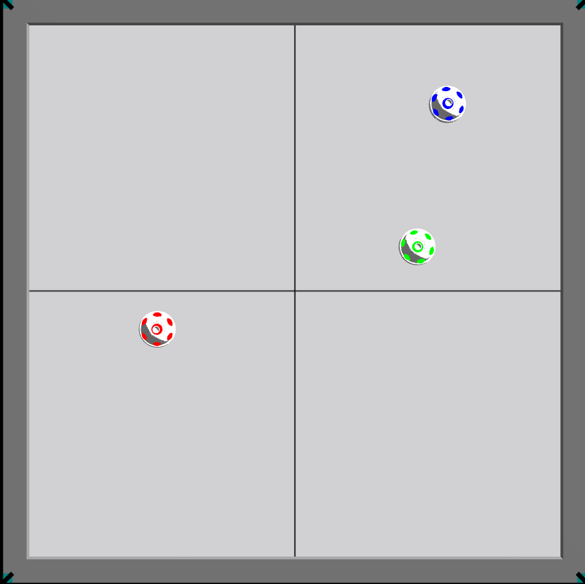
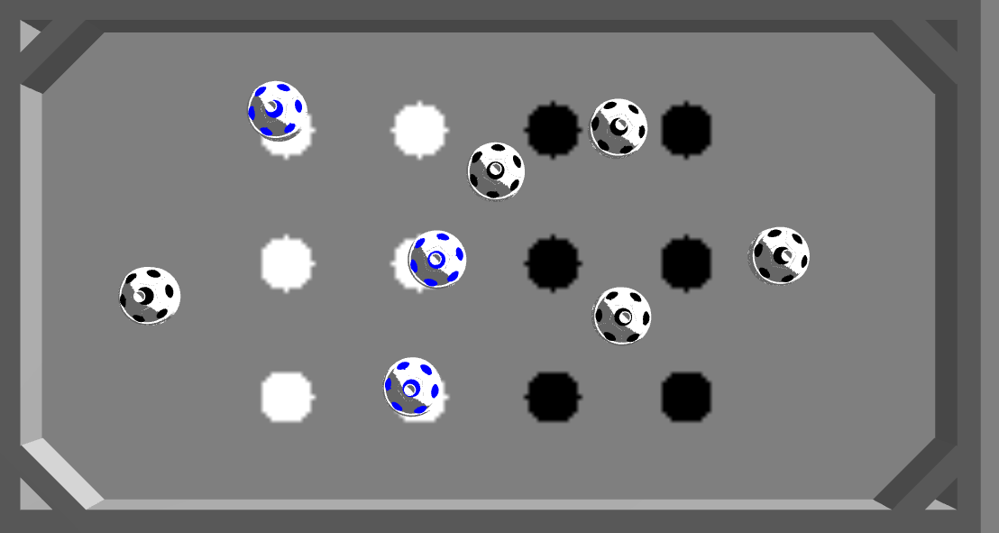
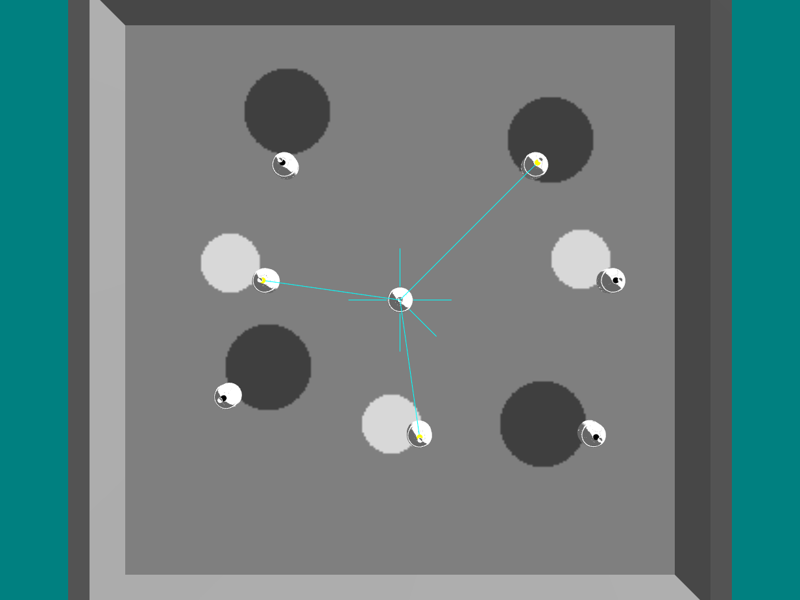

# Argos QUPA robot

The QUPA robot is a modular, low-cost platform developed in Ecuador by the CoRAL laboratory at the Escuela Superior Politécnica del Litoral (ESPOL). Designed and focuses on swarm robotics applications. The platform is built to be easy to assemble and operate.

### Key Features
- **Omnidirectional camera**
- **6 proximity sensors**
- **1 ground color sensor**
- **5 LEDs**
- **UV-LEDs**


*Current Development:* A gripper mechanism is currently being implemented for the robot.

## How to Compile the Argos3 QUPA Robot

Follow these steps to compile the QUPA robot binaries for the Argos3 simulator.

### 1. Clone the Repository
Download the source code from the GitHub repository:

```bash
git clone https://github.com/coral-espol/qupa_v2.git
```

### 2. Compile the binaries 

Navigate to the project directory and run the build process.

```
cd ~/qupa_v2
rm -rf build && mkdir build && cd build
```
Configure the build with CMake. 

```
cmake ../src \
  -DCMAKE_BUILD_TYPE=Release \
  -DARGOS_BUILD_FOR=simulator \
  -DCMAKE_INSTALL_PREFIX="$HOME/swarm_robotics/argos3-dist"

make -j"$(nproc)"
make install
```
> Note: You must to edit your **DCMAKE_INSTALL_PREFIX** with your diretory where argos3 was installed. 

To know where argos3 was installed and your own rute put in your terminal the next command.

```
which argos3 
```
the next command line is an example for other location.
```
cmake -DCMAKE_BUILD_TYPE=Release \
      -DARGOS_BUILD_FOR=simulator \
      -DCMAKE_INSTALL_PREFIX="/usr/local" \
      -DCMAKE_PREFIX_PATH="/usr/local" \
      ../qupa
make -j"$(nproc)"
make install
```

### 3. Test the argos QUPA robot 

```
argos3 -c arenas/test_qupa.argos
```
<!-- 
 -->

### 4. Media material

Here you can find a some examples (click on the image to show the video).

1. Simple simulation with the QUPA robot
[](https://drive.google.com/file/d/1NISa6QuCtN9FcV-uvQB4OstGJXl4G2BH/view?usp=sharing) 

2. Making experiments example 1
[](https://drive.google.com/file/d/1CMT9WoHcIdt_1VtyqQ2vo7GJ7JlBuMgB/view?usp=sharing) 

3. Making experiments example 2
[](https://drive.google.com/file/d/18gKZoMNuN__hlouXpRjukzwSWbfgSCyx/view?usp=drive_link)


